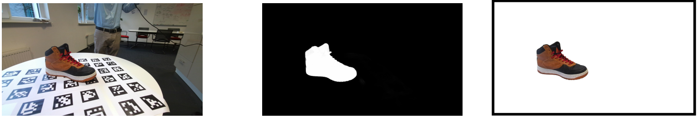
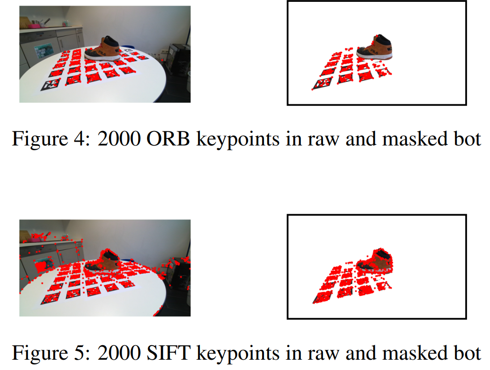

# 3D-Reconstruction-with-Bundle-Adjustment

This project focuses on 3D reconstruction from noisy 2D images using bundle adjustment. The main goal was to accurately estimate camera parameters and reconstruct the 3D structure of an object through a two-step process.

## Overview
### Correspondence Extraction:

### Image Preprocessing: 
Initial experiments with image segmentation models (DIS) to isolate the object.
Keypoint Detection & Matching: Employed SIFT and ORB algorithms for feature extraction and matching across images.
Filtering Matches: Applied optical flow-based assumptions to refine matches, ensuring only reliable correspondences were retained.

## Structure-from-Motion (SfM):

### Camera Pose Estimation: 
Computed the Fundamental and Essential matrices to derive camera poses using RANSAC for outlier removal.
3D Point Cloud Reconstruction: Utilized triangulation and PnP algorithms to generate and optimize 3D point clouds.
Bundle Adjustment: Refined both camera parameters and 3D points through iterative optimization to minimize reprojection errors.

### Tools & Techniques
Image Segmentation: DIS (Dichotomous Image Segmentation)
Feature Matching: SIFT, ORB
Optimization: RANSAC, SVD, Least Squares
Visualization: Open3D

### Conclusion
This project demonstrates a methodical approach to reconstructing 3D structures from 2D images by leveraging advanced computer vision techniques, ensuring high accuracy in camera pose estimation and point cloud generation.
